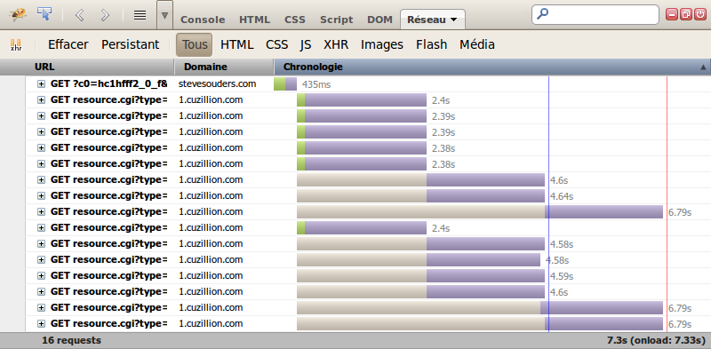
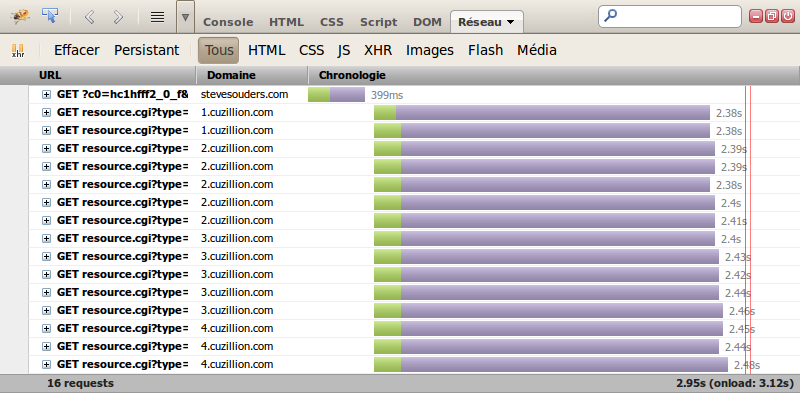
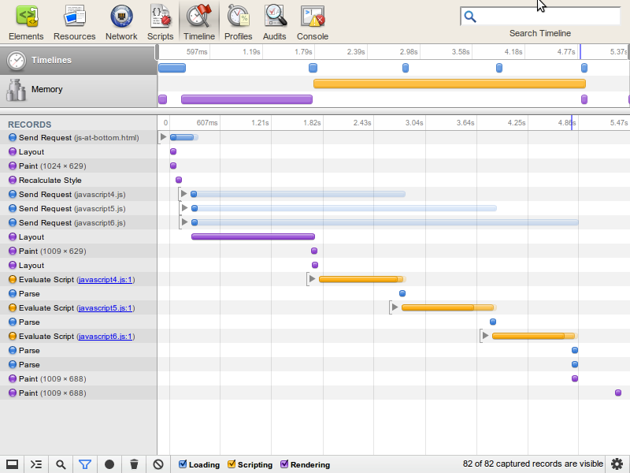

<!-- title : Speed is your #1 feature -->
<!-- author : Hubert SABLONNIÈRE -->
<!-- description : Web performances in general : JS, DOM, CSS, Network... -->
<!-- keywords : performances, speed, JavaScript, DOM, CSS, Network -->

<link href="../css/bootstrap.min.css" rel="stylesheet" data-dztheme="article">
<link href="../css/bootstrap-responsive.min.css" rel="stylesheet" data-dztheme="article">
<link href="../css/hljs-github.css" rel="stylesheet">
<link href="../css/theme-2012.css" rel="stylesheet">
<link href="../css/theme-2012-common.css" rel="stylesheet" data-dztheme="article">
<link href="../css/theme-2012-article.css" rel="stylesheet" data-dztheme="article">
<link href="../css/theme-2012-presentation.css" rel="alternate stylesheet" data-dztheme="presentation">
<link href="../css/speed-is-your-1-feature.css" rel="alternate stylesheet" data-dztheme="presentation">

<!-- slide : cover -->

# Speed is your #1 feature

<!-- toc -->

<!-- slide : introduction -->

#### This isn't a car

<!-- .list.incremental -->
Like some big search engine says, **"Speed should be your number one feature!"**. If you were aksed to build a website now, you'll have **trouble to make it scale**. Building an optimized website is hard. There's a **lot of techniques** to master. Each one has an explanation, **there's no magic tricks**. **Pay attention to details** and you're next huge website will be **really fast**!

<!-- slide -->

## The golden rule

<!-- .quote -->
> "If you don't have optimized your frontend, you don't have optimized."

<!-- slide -->

## Importance of performance

<!-- .incremental -->
* Google<br>500 ms slower => 20% drop in traffic
* Yahoo!<br>400 ms slower => 5-9% drop in full page traffic
* Amazon<br>100 ms slower => 1% drop in sales
  
<!-- slide : cover -->

## Network

<!-- slide : cover -->

### The 80/20 rule
  
Only 10-20% of the end user response time is spent downloading the HTML document.

The other 80-90% is spent downloading all the components and parsing/executing them...
  
<!-- slide -->

#### Example with `www.fnac.com`

46ms are spent just to establish the connection.

211ms are spent on server side.

156ms are spent to download the response.

It makes a total of 412ms for a 3100ms loading time => 13%.
  


<!-- slide -->

#### Other websites

<table id="time-spent-table">
  <thead>
    <tr><td class="empty">  <td>Time Retrieving HTML  <td>Time Elsewhere
  </thead>
  <tbody>
    <tr><td>Yahoo!   <td>10%  <td>90%
    <tr><td>Google   <td>25%  <td>75%
    <tr><td>MySpace  <td>9%   <td>91%
    <tr><td>MSN      <td>5%   <td>95%
    <tr><td>ebay     <td>5%   <td>95%
    <tr><td>Amazon   <td>38%  <td>62%
    <tr><td>YouTube  <td>9%   <td>91%
    <tr><td>CNN      <td>15%  <td>85%
  </tbody>
</table>

<!-- slide -->

### Reduce the number of requests
  
Each time you make an HTTP round trip, you're losing time and bandwith. Don't forget about the HTTP header and the time spent to send the request and receive the response.

The best thing to do is to merge resources. Be smart don't deliver just one CSS and one JavaScript file. A good idea is to have a global one that is used all over the site and one specific for the current page. Here's an example.

<!-- .incremental -->
```html
<link rel="stylesheet" type="text/css" href="/css/main.css" />
<link rel="stylesheet" type="text/css" href="/css/forms.css" />
<link rel="stylesheet" type="text/css" href="/css/table.css" />
<link rel="stylesheet" type="text/css" href="/css/layout.css" />
<link rel="stylesheet" type="text/css" href="/css/signup.css" />
<link rel="stylesheet" type="text/css" href="/css/faq.css" />
<!-- etc... -->
```

<!-- .incremental -->
```html
<!-- One file global for the entire site -->
<link rel="stylesheet" type="text/css" href="/css/global.css" />
<!-- One file specific to the current page -->
<link rel="stylesheet" type="text/css" href="/css/my-page.css" />
```

<!-- slide : cover -->

### Split components across domains
  
The HTTP 1.1 specification suggests that browsers download two components in parallel per hostname. Nowaday, most recent browsers paralellize 6 downloads in parallel but IE6 and IE7 are still limited to 2.

Using multiple subdomains you can parallelize more components and load your pages faster.
  
<!-- slide -->

#### One domain example



<!-- slide -->

#### Multiple domains example



<!-- .useful-links -->
* [Cuzillion (stevesouders.com)](http://stevesouders.com/cuzillion/)
* [Har viewer (softwareishard.com)](http://www.softwareishard.com/har/viewer/)
  
<!-- slide : cover -->

### Reduce DNS lookup
  
Each time your browser needs to reach a new hostname, it has to resolve its IP using DNS. It adds time to your total reponse time and can damage performance. However, because there are benefits from using multiple hostnames to induce parallel downloads, this depends somewhat on the number of resources served per page. The optimal number is somewhere between 1 and 5 hosts (1 main host plus 4 hosts on which to parallelize cacheable resources). As a rule of thumb, you shouldn't use more than 1 host for fewer than 6 resources; fewer than 2 resources on a single host is especially wasteful.

<!-- slide : cover -->

### Use compression
  
Enable compression on server side. This is mandatory, you can save huge amount of bandwith using this. DO NOT compress binary files, only text ones.
  
<!-- slide -->

#### Example with compression

<!-- .incremental -->
```http
GET /wiki/The_Dark_Knight HTTP/1.1
Host: fr.wikipedia.org
User-Agent: Mozilla/5.0 (X11; Linux i686) AppleWebKit/535.2...
Accept: text/html,application/xhtml+xml,application/xml;q=0.9,*/*;q=0.8
Accept-Encoding: gzip,deflate,sdch
Accept-Language: en-US,en;q=0.8,fr-FR;q=0.6,fr;q=0.4
Accept-Charset: ISO-8859-1,utf-8;q=0.7,*;q=0.3          /* ... */
```

<!-- .incremental -->
```http
HTTP/1.0 200 OK
Server: Apache
Content-Type: text/html; charset=UTF-8
Content-Encoding: gzip
Content-Language: fr
Content-Length: 62477                                   /* ... */
```

<!-- slide -->

#### Comparison

```http
GET /wiki/The_Dark_Knight HTTP/1.1
```

<!-- .incremental -->
* 294 306B   100% (no compression)
* 62 477B    21%  (gzip)
  
<!-- slide -->

### Cookies

<!-- .incremental -->
* Reduce their size
* Serve static contents with cookie less domain
  
<!-- slide : cover -->

### Use HTTP cache properly

<!-- slide -->

#### Expiration
  
Expiration can use two headers `Expires` and `Cache-Control: max-age=5`. Using these headers, servers provide informations for content expiration. Clients can overload them.

<!-- .incremental -->
```http
GET /skins-1.18/common/images/magnify-clip.png HTTP/1.1
Host: bits.wikimedia.org
Cache-Control: no-cache    /* ... */
```

<!-- .incremental -->
```http
HTTP/1.1 200 OK
Cache-Control: max-age=2592000
Expires: Wed, 14 Dec 2011 12:07:44 GMT
Age: 588240                /* ... */
```

<!-- .incremental -->
```http
GET /skins-1.18/common/images/magnify-clip.png HTTP/1.1
Host: bits.wikimedia.org
Cache-Control: max-age=0   /* ... */
```

<!-- .incremental -->
```http
HTTP/1.1 304 Not Modified
Cache-Control: max-age=2592000
Expires: Wed, 14 Dec 2011 12:07:44 GMT
Age: 588240                /* ... */
```

<!-- slide -->

#### Validation
  
Validation can use two set of headers `If-Modified-Since/Last-Modified` and `If-None-Match/ETag`. Using these headers, servers provide informations for content validation (date and data). Clients can overload them.

<!-- .incremental -->
```http
GET /skins-1.18/common/images/magnify-clip.png HTTP/1.1
Host: bits.wikimedia.org
If-Modified-Since: Mon, 19 Sep 2011 16:10:23 GMT
If-None-Match: "cc-4ad4d9489f9c0"                   /* ... */
```

<!-- .incremental -->
```http
HTTP/1.1 304 Not Modified
Last-Modified: Mon, 19 Sep 2011 16:10:23 GMT
ETag: "cc-4ad4d9489f9c0"                            /* ... */
```

<!-- .useful-links -->
* [Caching on the edge (by Fabien Potencier slideshare)](http://www.slideshare.net/fabpot/caching-on-the-edge)
* [RFC 2616 (IETF)](http://www.ietf.org/rfc/rfc2616.txt)
  
<!-- slide -->

### Use a CDN
  
A CDN is a content delivery network. It consist of a system of computers containing copies of data placed at various nodes of a network. Request are served by the closest node which has a cached version of the contents from yout central server.
  


<!-- .useful-links -->
* [Akamai](http://www.akamai.fr/enfr/)
* [Amazon CloudFront](http://aws.amazon.com/cloudfront/)
* [Cloudflare](https://www.cloudflare.com/)
* [Mirror image](http://www.mirror-image.com/site/)
* [Limelight](http://www.limelight.com/)
* [Challenges of delivering content and applications on the Internet (by Tom Leighton, Akamai founder) (Youtube)](http://www.youtube.com/watch?feature=player_embedded&v=gISR8aUgYRQ#!)
  
<!-- slide -->

### Avoid redirects and errors
  
Redirects can have useful usage :

<!-- .incremental -->
* To indicate that something has moved.
* To catch mispelled URLs.
* To connect between different parts of a site or application (country-code, protocols...).
* After a form POST.
    
Except from theses cases, try to avoid redirects, it saves time and bandwidth.
  
<!-- slide : cover -->

## HTML

<!-- slide : cover -->

### Validate your markup
  
Except from the fact that unvalid documents do not ensure correct browser handling, they can also push browsers to take more time to process markup.
  
<!-- slide -->

### DOM Elements
  
Because the DOM is an object representing a giant DOM, the less elements you have the faster web page you get.Try to keep it small.

Not only for JavaScript but also for CSS computations, the depth of your DOM can have impacts on perfomances. Try to keep it low.

<!-- .incremental -->
* DOM depth : small is better
* Number of elements : small is better

<!-- .useful-links -->
* [DOM Monster](http://mir.aculo.us/dom-monster/)
  
<!-- slide : cover -->

## CSS

<!-- slide -->

### Minify/compress
  
It's one of the most important rule. The process consist of 2 steps : removing all unnecessary characters. Some tools are also able to optimize some parts of the code. It's a great way to save bandwidth.

<!-- .incremental -->
* Twitter bootstrap :
* `bootstrap.css       121.7KB   100%`
* `bootstrap.min.css   101.3KB    83%`

<!-- .useful-links -->
* [960.gs](http://960.gs/)
  
<!-- slide : cover -->

### CSS on top
  
Browsers block rendering a web page until all external stylesheets have been downloaded. If you used, inline `style` elements, it can cause reflows and shifting of contents. This way the page can be progressively rendered.
  
<!-- slide : cover -->

## JavaScript

<!-- slide -->

### Minify/compress
  
It's one of the most important rule. The process consist of 2 steps : removing all unnecessary characters and potentially rename functions and variables where it has no consequenses. Some tools are also able to optimize some parts of the code. It's a great way to save bandwidth.

<!-- .incremental -->
* jQuery bootstrap :
* `jquery-1.8.3.min.js   262KB   100%`
* `jquery-1.8.3.min.js    92KB    35%`

<!-- .useful-links -->
* [jQuery 1.7 minified (jquery.com)](http://code.jquery.com/jquery-1.7.min.js)
* [jQuery 1.7 non-minified (jquery.com)](http://code.jquery.com/jquery-1.7.js)
  
<!-- slide -->

### JavaScript at bottom
  
Even if it's not natural, putting JavaScript at the bottom should be the golden rule!

The different advantages are :

<!-- .incremental -->
* You don't need to listen and wait for `load` or `DOMContentLoaded` events to fire.
* Page will render before trying to parse scripts...

<!-- .useful-links -->
* [Where To Include JavaScript Files In A Document (http://robertnyman.com)](http://robertnyman.com/2008/04/23/where-to-include-javascript-files-in-a-document/)

<!-- slide -->

#### JS in head

When the JavaScript is in the `head`, the browser waits for scripts to be downloaded to calculate style and paint the layout.


  
<!-- slide -->

#### JS at end of body
  
When the JavaScript is at the bottom of `body`, the browser does not wait for scripts to be downloaded to calculate style and paint the layout.
  


<!-- slide -->

### Minimize DOM Access
  
Nowadays, JavaScript is really fast. What can be slow in a browser is the DOM. Optimize your access (read/write) to the DOM and you'll have a faster website.

<!-- .incremental -->
```javascript
// BAD
for (var i = 0; i < 1000; i++) {
  document.getElementById('joker').innerHTML += i + ' ';
}
```

<!-- .incremental -->
```javascript
// DOM access => (1 get + 1 set) * 1000 => 2000 operations ~ 120ms
```

<!-- .incremental -->
```javascript
// GOOD
var content = '';
for (var i = 0; i < 1000; i++) {
  content += i + ' ';
}
document.getElementById('joker').innerHTML += content;
```

<!-- .incremental -->
```javascript
// DOM access => 1 get + 1 set          =>    2 operations ~ 1ms
```

<!-- .useful-links -->
* [Simple DOM access (jsperf.com)](http://jsperf.com/simple-dom-access)
  
<!-- slide : cover -->

## Images

<!-- slide -->

### Use sprites

Sprites allow you to use only one HTTP request/response to retreive images. It saves time and bandwidth.

All the big web sites use it to get faster.

Use it for icons and decoratives stuffs but keep separates files for photos and real images.


<!-- slide -->

#### Google example

<!-- .incremental -->
```html
<span class="csb gbil ch" style="background-position:-74px 0;width:20px"></span>
```

<!-- .incremental -->
```css
.csb, .ss, .play_icon, .mini_play_icon, .micon, .licon, .close_btn, #tbp, .mbi, .inline_close_btn {
  background: url(/images/nav_logo95.png) no-repeat;
  overflow: hidden;
}

.csb, .ss {
  background-position: 0 0;
  height: 40px;
  display: block;
}
```

<!-- .useful-links -->
* [smushit.com](http://www.smushit.com/ysmush.it/)
* [spritegen](http://spritegen.website-performance.org/)
* [compass-style.org](http://compass-style.org/help/tutorials/spriting/)
* [csssprites.com](http://csssprites.com/)
  
<!-- slide -->

### Specify dimensions

If you specify dimensions on images like in the example, your browser will only paint the images once they're downloaded. If you don't, you're browser will recalculate the layout each time an image is downloaded. It can be a visual issue for your visitors and it consumes time and CPU.

<!-- .incremental -->
```

```

<!-- .incremental -->
```

```

<!-- slide -->

### Inline images / Data URIs
  
This process can be an alternative to sprites. You can convert your images to a text representation. It takes a little more space but if you gzip you should be OK. It's better to use it in CSS an cachable resources.

<!-- .incremental -->
```css
li {
  background:
    url() no-repeat left center;
  padding: 5px 0 5px 25px;
}
```

<!-- .incremental -->
```html

```

<!-- .incremental -->
```css
data:[<mime type>][;charset=<charset>][;base64],<encoded data>
```

<!-- .incremental -->
```css
/* Doesn't work on IE<8 */
```

<!-- .useful-links -->
* [Data URIs (css-tricks.com)](http://css-tricks.com/5970-data-uris/)
* [Image to Data URI convertor (websemantics.co.uk)](http://websemantics.co.uk/online_tools/image_to_data_uri_convertor)
  
<!-- slide -->

### Optimize images
  
There's plenty of tools on the web to compress your images, with or without data loss.

* [jpegoptim](http://freecode.com/projects/jpegoptim)
* [OptiPNG](http://optipng.sourceforge.net/)
* [PNGOUT](http://www.advsys.net/ken/util/pngout.htm)
* [PunyPNG](http://www.punypng.com/)
* [JPEGmini](http://www.jpegmini.com/main/home)
  
<!-- slide -->

## Links & documentation

* [Google page speed (google.com)](http://code.google.com/speed/page-speed/docs/rules_intro.html)
* [Speedy apps (slideshare.net)](http://www.slideshare.net/caillou/speedy-app-frontend-performance-considerations)
* [Caching on the edge (slideshare.net)](http://www.slideshare.net/fabpot/caching-on-the-edge)
* [High performance web pages... (slideshare.net)](http://www.slideshare.net/stoyan/high-performance-web-pages-20-new-best-practices)
* [Don't make me wait... (slideshare.net)](http://www.slideshare.net/stoyan/dont-make-me-wait-or-building-highperformance-web-applications)
* [High performance DOM scripting (slideshare.net)](http://www.slideshare.net/stoyan/high-performance-dom-scripting)

<div id="progress-bar"></div>

<script src="../js/dzslides.core.js"></script>
<script src="../js/jquery-1.8.1.min.js"></script>
<script src="../js/bootstrap.min.js"></script>
