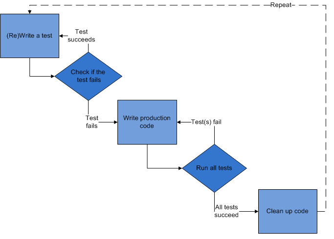

<!-- title : Testing, testing... -->
<!-- author : Hubert SABLONNIÈRE -->
<!-- description : Details about how to test a JavaScript application/website. -->
<!-- keywords : unit-tests, functional tests... -->

<link href="../css/bootstrap.min.css" rel="stylesheet" data-dztheme="article">
<link href="../css/bootstrap-responsive.min.css" rel="stylesheet" data-dztheme="article">
<link href="../css/hljs-github.css" rel="stylesheet">
<link href="../css/theme-2012.css" rel="stylesheet">
<link href="../css/theme-2012-common.css" rel="stylesheet" data-dztheme="article">
<link href="../css/theme-2012-article.css" rel="stylesheet" data-dztheme="article">
<link href="../css/theme-2012-presentation.css" rel="alternate stylesheet" data-dztheme="presentation">
<link href="../css/have-a-look-at-my-prototype.css" rel="alternate stylesheet" data-dztheme="presentation">

<!-- slide : cover -->

# Testing, testing...

<!-- toc -->

<!-- slide -->

## TDD
  
TDD means Test Driven Developement. The process is fairly simple. Don't forget that your code should only pass the test and not the specifications. If your code passes the tests and doesn't follow the specifications, it means your test is wrong.
  


<!-- slide : cover -->

## Synchronous code

<!-- slide -->
  
To perform a synchronous test, you must use the `test()` function and provide it a name and a function to execute. This function should contain from 1 to many assertions.
  
### Simple example

<!-- .incremental -->
```javascript
var add = function(a, b) {
  return a + b;
}
```

<!-- .incremental -->
```javascript
test('Try with positive numbers', function() {
  strictEqual(add(3, 8), 11, '3 + 8 = 11');
  strictEqual(add(0, 5), 5, '0 + 5 = 5');
});
```

<!-- .incremental -->
```javascript
test('Try with negative numbers', function() {
  strictEqual(add(-5, -7), 12, '-5 + -7 = -12');
  strictEqual(add(-0, -8), -8, '-0 + -8 = -8');
});
```

<!-- slide -->

### Other assertions
  
There's plenty of other assertions that `strictEqual`, use them carefully.

<!-- .incremental -->
* `ok(state, message)`
* `equal(actual, expected, message)`
* `notEqual(actual, expected, message)`
* `deepEqual(actual, expected, message)`
* `notDeepEqual(actual, expected, message)`
* `strictEqual(actual, expected, message)`
* `notStrictEqual(actual, expected, message)`
* `raises(block, expected, message)`

<!-- .useful-links -->
* [QUnit documentation (jquery.com)](http://docs.jquery.com/QUnit#API_documentation)
  
<!-- slide -->

## Asynchronous code
  
To perform an asynchronous test, you must use the `asyncTest()` function and provide it a name and a function to execute. This function should contain from 1 to many assertions. One of the ways to handle async stuffs such as AJAX calls is to use `setTimeout()`.

<!-- .incremental -->
```javascript
function someFunctionWithAjax() {
  $.ajax({
    url: 'hello-world.php',
    success: function(data) { globalVar = data; }
  });
}
```

<!-- .incremental -->
```javascript
asyncTest('Testing AJAX function', function() {
  // Pause the test
  stop();

  someFunctionWithAjax();

  setTimeout(function() {
    ok(typeof globalVar !== undefined, 'globalVar is defined');
    // After the assertion has been called, continue the test
    start();
  }, 2000);
});
```

<!-- .useful-links -->
* [How to Test your JavaScript Code with QUnit (net.tutsplus.com)](http://net.tutsplus.com/tutorials/javascript-ajax/how-to-test-your-javascript-code-with-qunit/)
  
<!-- slide : cover -->

## Functional tests
  
The best tool in this area is Selenium. The project provide Macro recordin IDE and some drivers for programming languages and browsers.

<!-- .useful-links -->
* [Selenium IDE](http://seleniumhq.org/projects/ide/)

<div id="progress-bar"></div>

<script src="../js/dzslides.core.js"></script>
<script src="../js/jquery-1.8.1.min.js"></script>
<script src="../js/bootstrap.min.js"></script>
